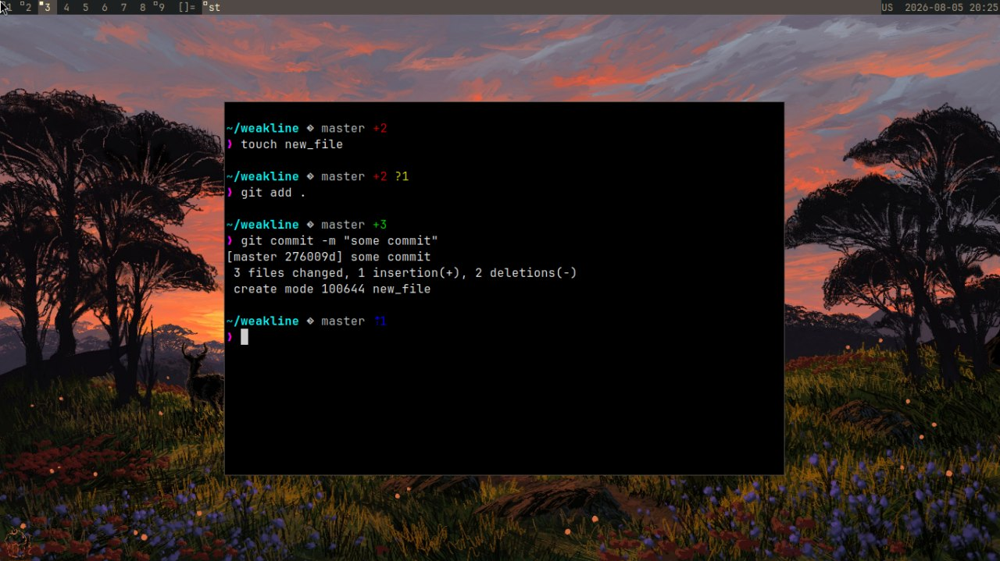

# weakline

A minimal, asynchronous Zsh prompt in Go. Fast enough, clean, and zero framework dependency.

> **Why weak?**
> It's written in Go - bringing a full Garbage Collector just to render two lines of text. It's not zero-allocation, nor the absolute limit of modern prompt engineering. But it runs background tasks via OS `flock`, caches reliably, and gets out of your way.



## Features

- **Async Git:** Offloads `git status` to a background worker with `flock` and `SIGUSR1` signals.
- **Fast Enough:** Simple Go buffer formatting, low memory overhead.
- **Color Support:** Named ANSI, TrueColor HEX (`#RRGGBB`), and 256-color codes.
- **Self-Contained:** Single static binary. No Node, Python, or Zsh plugin managers.

## Trade-offs

- **Go Runtime:** Spawns a full Go runtime on execution. Use Rust/C if sub-microsecond cold starts are critical.
- **Zsh Only:** Relies on Zsh-specific prompt hooks and `TRAPUSR1`.

## Comparisons

* **vs Pure:** Keeps the clean layout, but adds granular Git indicators (staged, unstaged, ahead/behind) out of the box.
* **vs Powerlevel10k:** Strips away dozens of unused segments and massive `.p10k.zsh` configs in favor of a single binary.

## Configuration

Weakline relies on compile-time configuration (`config.go`). You tweak icons, timeouts, and colors directly in the code structure before building.

Since the configuration is compiled into a single static binary, you can easily copy your executable across machines without carrying around external config files or dotfiles ecosystems.

## Installation

Build the binary:
```bash
make
```
Or install it directly to your path (e.g. `~/.local/bin`):
```bash
make install
```
Add initialization to `~/.zshrc`:
```bash
eval "$(weakline init zsh)"
```

